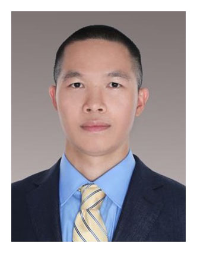

# Intelligent Vehicles Lab
Our main research focuses are energy management, autonomous driving and reinforcement learning. At present, we have one PI, two PhDs and eight masters in our laboratory.  

***

# People
### Principal Investigator:

 <big>**Yuan Lin(林远)**</big>: Yuan:
Yuan Lin received the B.E. degree in civil engineering from Nanchang University, Nanchang, China, in 2011 and the Ph.D. degree in engineering mechanics from Virginia Tech, Blacksburg, VA, USA, in 2016. He was a Postdoctoral Fellow with the Mechanical Engineering Department, Virginia Tech, from 2016 to 2018, and with the Systems Design Engineering Department, University of Waterloo, Waterloo, ON, Canada, from 2018 to 2020. He is currently an Assistant Professor with the Shien-Ming Wu School of Intelligent Engineering, South China University of Technology, Guangzhou, China.

  
  
  

***

## PhD Students:

 
 
**Changfu Gong(龚长富)**: September 2021 - Present 
**Research Interests**: Reinforcement Learning, Energy Management for Hybrid Electric Vehicles.
 
 
 
 

 
 
**Jinming Xu(徐锦明)**: September 2021 - Present 
**Research Interests**: Mixed-Integer Control, Safe Reinforcement Learning, Hybrid Electric Vehicles.
 
 
 
 

***  

## Master Students:
 
 
 
**Xiao Liu(刘啸)**: September 2021 - Present 
**Research Interests**: Reinforcement Learning, Intelligent Lane Change, Optimal Control.
 
 
 
 
 
 
 
**Qitao Li(黎启涛)**: September 2022 - Present 
**Research Interests**: Adaptive Cruise Control, Hybrid Electric Vehicles.
 
 
 
 
 
 
 
 
**Ruichen Xu(徐瑞辰)**: September 2022 - Present 
**Research Interests**: Safe Reinforcement Learning.
 
 
 
 
 
 
 
 
**Haonan Wu(吴浩楠)**: September 2022 - Present 
**Research Interests**: Reinforcement Learning.
 
 
 
 
 
 
 
 
**Antai Xie(谢安泰)**: September 2022 - Present 
**Research Interests**: Deep Learning.
 
 
 
 
 
 
 
 
**Zishun Zheng(郑子顺)**: September 2023 - Present 
**Research Interests**: Autonomous Lane Change of Intelligent Vehicle.
 
 
 
 
 
 
 
 
**Liyao Wang(王立尧)**: September 2023 - Present 
**Research Interests**: Multi-Agent Reinforcement Learning.
 
 
 
 
 
 
 
 
**Zifeng Chen(陈梓锋)**: September 2024 - Present 
**Research Interests**: Intelligent Vehicle.
 
 
 
 
 
 
 
 
**Zhenning Zhu(朱振宁)**: September 2024 - Present 
**Research Interests**: Reinforcement Learning.
 
 
 
 
 
***

# Selected Publications
* [Zheng Z, Liu X, Lin Y. Highway Discretionary Lane-change Decision and Control Using Model Predictive Control[J]. Asian Control Conference, Accepted.](https://arxiv.org/abs/2402.17524)
* [Wang L, Zheng Z, Lin Y. Steady-State Error Compensation for Reinforcement Learning with Quadratic Rewards[J]. Asian Control Conference, Accepted.](https://arxiv.org/abs/2402.09075)
* [Xu R, Xu J, Liu X, et al. Safe hybrid-action reinforcement learning-based decision and control for discretionary lane change[J]. Machines, 2024, 12(4): 252.](https://www.mdpi.com/2075-1702/12/4/252)
* [Gong C, Xu J, Lin Y. Plug‐In Hybrid Electric Vehicle Energy Management with Clutch Engagement Control via Continuous‐Discrete Reinforcement Learning[J]. Energy Technology, 2024: 2301512.](https://onlinelibrary.wiley.com/doi/full/10.1002/ente.202301512)
* [Xu J, Lin Y. Energy Management for Hybrid Electric Vehicles Using Safe Hybrid-Action Reinforcement Learning[J]. Mathematics, 2024, 12(5): 663.](https://www.mdpi.com/2227-7390/12/5/663)
* [Xu J, Lin Y. Mixed-Integer Optimal Control via Reinforcement Learning: A Case Study on Hybrid Vehicle Energy Management[J]. arXiv preprint arXiv:2305.01461, 2023.](https://arxiv.org/abs/2305.01461)
* [Li Q, Gong C, Lin Y. Co-Optimization of Adaptive Cruise Control and Hybrid Electric Vehicle Energy Management via Model Predictive Mixed Integer Control[C]//2023 42st Chinese Control Conference (CCC). IEEE, 2023:6557-6562.](https://ieeexplore.ieee.org/document/10241172)
* [Lin Y, McPhee J, Azad N L. Co-Optimization of On-Ramp Merging and Plug-In Hybrid Electric Vehicle Power Split Using Deep Reinforcement Learning[J]. IEEE Transactions on Vehicular Technology, 2022, 71(7): 6958-6968.](https://ieeexplore.ieee.org/abstract/document/9757859)
* [Lin Y, J. McPhee and N. L. Azad, "Comparison of Deep Reinforcement Learning and Model Predictive Control for Adaptive Cruise Control," in IEEE Transactions on Intelligent Vehicles, vol. 6, no. 2, pp. 221-231, June 2021, doi: 10.1109/TIV.2020.3012947.](https://ieeexplore.ieee.org/abstract/document/9152161)
* [Lin Y, Azim Eskandarian, 2020: “Integrating Inter-Vehicular Communications, Vehicle Localization, and a Digital Map for Cooperative Adaptive Cruise Control with Target Detection Loss,” SAE International Journal of Connected and Automated Vehicles, 3(3), 193-204.](https://arxiv.org/abs/1901.02989)

***
# Facilities
## The Driving Simulator System
&emsp; 
* Vehicle in the loop.

***

